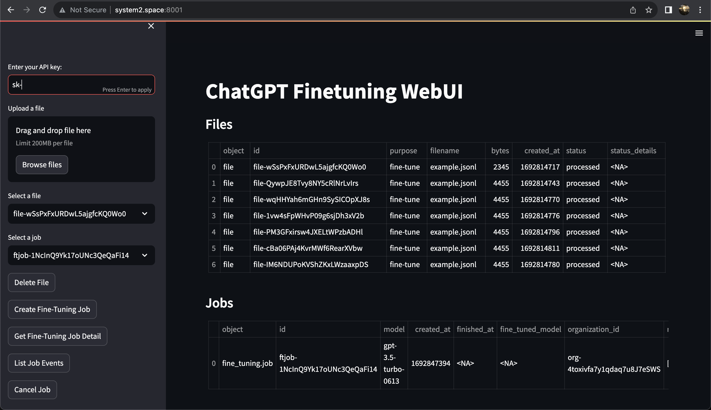

# chatgpt-finetune-ui
Simple python WebUI for fine-tuning gpt-3.5-turbo




## Installation
```
pip install openai
pip install streamlit
```

## Usage
```
streamlit run main.py --server.port 8001 --server.address 0.0.0.0
```

## Experimental Demo
[http://system2.space:8001](http://system2.space:8001)
